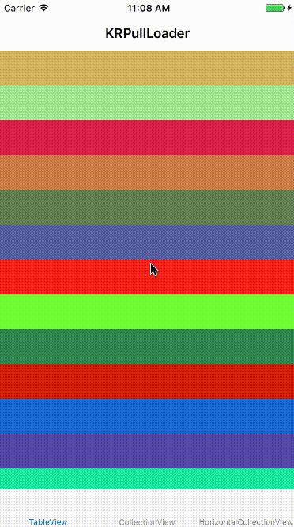

[日本語](./README_Ja.md)

# KRPullLoader

[](http://cocoapods.org/pods/KRPullLoader)
[](http://cocoapods.org/pods/KRPullLoader)
[](http://cocoapods.org/pods/KRPullLoader)
[](http://cocoapods.org/pods/KRPullLoader)
[](https://github.com/Carthage/Carthage)
[](https://travis-ci.org/krimpedance/KRPullLoader)



## Features
- Easy-to-use
- Possibles both of `pull refresh` and `load more`.

## Requirements
- iOS 9.0+
- Xcode 8.0+
- Swift 3.0+

## DEMO
To run the example project, clone the repo, and open `KRPullLoaderDemo.xcodeproj` from the DEMO directory.

or [appetize.io](https://appetize.io/app/d17hjrvt0fm9mfg2crmqbu4qx4)

## Installation
KRPullLoader is available through [CocoaPods](http://cocoapods.org) and [Carthage](https://github.com/Carthage/Carthage).
To install it, simply add the following line to your Podfile or Cartfile:

```ruby
# CocoaPods
pod "KRPullLoader"
```

```ruby
# Carthage
github "Krimpedance/KRPullLoader"
```

## Usage
(see sample Xcode project in /Demo)

#### Add views

The simplest way:

```swift
let refreshView = KRPullLoadView()
refreshView.delegate = self
tableView.addPullLoadableView(refreshView, type: .refresh)
```

`KRPullLoadView` is a simple loading view which consists of `UIActivityIndicatorView` and `UILabel`.

The change in the state can be watched by the delegate method.

`type` has `.refresh` and `.loadMore` and can add either of UIScrollView's top and bottom.

#### Add custom views

You can design loading views freely by making custom UIView in succession to `KRPullLoadable` protocol

Please refer to [KRPullLoadView.swift](./KRPullLoader/Classes/KRPullLoadView.swift) or [HorizontalPullLoadView.swift](./DEMO/KRPullLoaderDemo/HorizontalPullLoadView.swift).

#### KRPullLoadable

```swift
/**
 Handler when KRPullLoaderState value changed.

 - parameter state: New state.
 - parameter type:  KRPullLoaderType.
*/
func didChangeState(_ state: KRPullLoaderState, viewType type: KRPullLoaderType)
```

#### KRPullLoaderState

This is enum which shows the state of the scrolling.

```swift
.none
  // hides the view.
.pulling(offset: CGPoint, threshold: CGFloat)
  // Pulling.
  // `offset` is pull offset (always <= 0).
  // This state changes to `loading` when `offset` exceeded `threshold`.
.loading(completionHandler: ()->Void)
  // Shows the view.
  // You should call `completionHandler` when some actions have been completed.
```

## Contributing to this project
I'm seeking bug reports and feature requests.

## Release Note
- 1.0.0 : First release.

## License
KRPullLoader is available under the MIT license. See the LICENSE file for more info.
